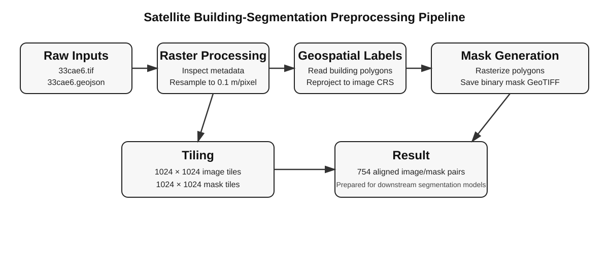
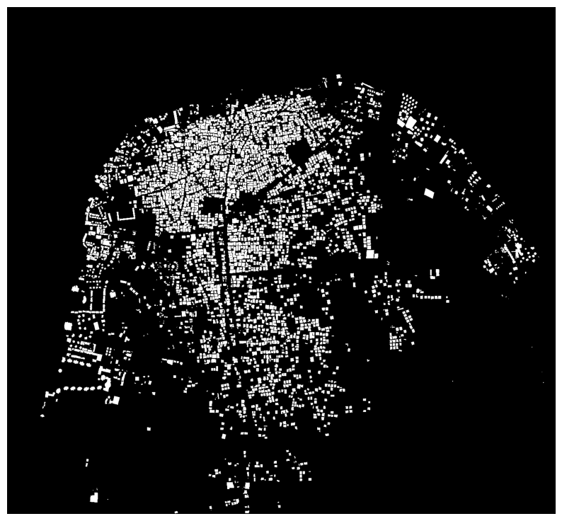
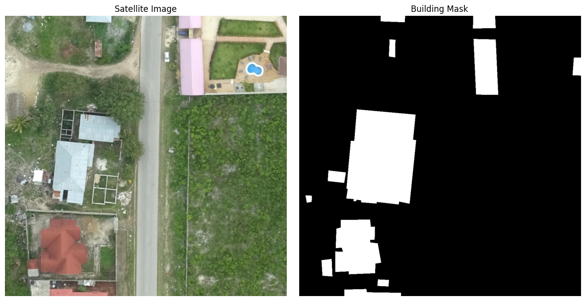

# Satellite Image Preprocessing for Building Segmentation

Reproduction of the geospatial preprocessing workflow described in Fractal AI's article, **[Understanding Satellite Image for Geo-spatial Deep Learning](https://medium.com/@fractal.ai/understanding-satellite-image-for-geo-spatial-deep-learning-a1a7dee2f2de)**.

The project uses the **Open Cities AI Challenge** building-segmentation dataset to prepare high-resolution aerial imagery and building-footprint annotations for a downstream segmentation model.

> **Scope:** This repository implements the preprocessing workflow demonstrated in the article. It does **not** train or evaluate a segmentation model.

## Objective

Starting from:

- a high-resolution GeoTIFF containing aerial imagery, and
- a GeoJSON containing building footprints,

produce aligned image/mask tiles that can be used as input and ground truth for a building-segmentation workflow.

## Pipeline



### High-level flow

1. Load and inspect the source GeoTIFF.
2. Resample the imagery from approximately **0.07748 m/pixel** to **0.1 m/pixel**.
3. Visualize the RGB imagery.
4. Load the building-footprint GeoJSON.
5. Reproject the building geometries to the image CRS.
6. Rasterize the polygons into a binary building mask.
7. Save the mask as a 1-bit GeoTIFF.
8. Split the image into **1024×1024** tiles.
9. Split the mask using the same spatial windows.
10. Verify that the image and mask tiles align.

## Dataset

This project uses the `znz/33cae6` scene from the **Open Cities AI Challenge** dataset.

Dataset source:
- Source Cooperative: https://source.coop/open-cities/ai-challenge
- DrivenData competition: https://www.drivendata.org/competitions/60/building-segmentation-disaster-resilience/
- Dataset DOI: https://doi.org/10.34911/rdnt.f94cxb

The dataset is publicly available and is licensed under ODbL-1.0 according to the Source Cooperative dataset page.

### Input scene

`33cae6.tif`:

- Width: **37,113 pixels**
- Height: **34,306 pixels**
- Bands: **4**
- CRS: **EPSG:32737**
- Resolution: **0.0774800032377243 m/pixel**

`33cae6.geojson`:

- **4,439** building-footprint features
- Building polygons represented as GeoJSON features

> The raw dataset is intentionally excluded from Git because the source TIFF is large and the generated tile directories contain hundreds of files.

## Results

### Generated building mask

The GeoJSON building polygons are rasterized into a binary mask where:

- `0` = background / non-building
- `1` = building



### Image and mask tile

Each image tile has a matching mask tile covering the same geographic region.



The final preprocessing stage produces:

- **754 image tiles**
- **754 matching mask tiles**
- tile size: **1024×1024**

## Project Structure

```text
satellite-geospatial-dl/
│
├── data/
│   ├── raw/                  # Original TIFF + GeoJSON (not tracked by Git)
│   ├── processed/            # Resampled image + generated mask
│   ├── images/               # 1024×1024 image tiles
│   └── masks/                # 1024×1024 mask tiles
│
├── notebooks/
│   └── 01_satellite_image_exploration.ipynb
│
├── outputs/                  # Optional generated visualizations
├── src/                      # Space for reusable Python code
├── .gitignore
└── README.md
```

## Requirements

The project was developed in **Ubuntu WSL** using Python and GDAL.

Recommended environment:

- Python 3.10+
- Ubuntu / WSL
- VS Code
- Git
- GDAL

### Python packages

```bash
pip install numpy matplotlib pillow tqdm fastcore
pip install rasterio geopandas shapely
pip install jupyter ipykernel
```

### System dependency

```bash
sudo apt update
sudo apt install gdal-bin
```

## Running the Project

### 1. Clone the repository

```bash
git clone https://github.com/Sanketsingh77/satellite-geospatial.git
cd satellite-geospatial
```

### 2. Create and activate a virtual environment

```bash
python3 -m venv .venv
source .venv/bin/activate
```

### 3. Install dependencies

```bash
python -m pip install --upgrade pip
pip install numpy matplotlib pillow tqdm fastcore
pip install rasterio geopandas shapely
pip install jupyter ipykernel
```

Install GDAL:

```bash
sudo apt update
sudo apt install gdal-bin
```

### 4. Download the input data

Create the data directories:

```bash
mkdir -p data/raw data/processed data/images data/masks
```

Download the `33cae6` TIFF and GeoJSON from the public Open Cities AI Challenge dataset and place them in:

```text
data/raw/33cae6.tif
data/raw/33cae6.geojson
```

The TIFF used in this project is the `train_tier_1/znz/33cae6/33cae6.tif` scene and the annotation file is the corresponding `33cae6.geojson` label file.

### 5. Open the notebook

Start Jupyter:

```bash
jupyter notebook
```

Or open the repository directly in VS Code and open:

```text
notebooks/01_satellite_image_exploration.ipynb
```

Select the `.venv` Python kernel.

### 6. Run the notebook from top to bottom

The notebook performs the complete preprocessing workflow in this order:

```text
Load GeoTIFF
    ↓
Inspect metadata
    ↓
Resample to 0.1 m/pixel
    ↓
Preview RGB imagery
    ↓
Load GeoJSON
    ↓
Reproject building footprints
    ↓
Rasterize building polygons
    ↓
Save binary mask GeoTIFF
    ↓
Generate 1024×1024 image tiles
    ↓
Generate 1024×1024 mask tiles
    ↓
Visualize aligned image/mask pairs
```

The complete implementation is contained in the notebook, so no separate training script is required for the preprocessing workflow covered here.

## Key Geospatial Concepts

### GeoTIFF vs GeoJSON

- **GeoTIFF**: raster image data plus geospatial metadata such as CRS, resolution, bounds, and transform.
- **GeoJSON**: vector geometries such as points, lines, and polygons; here, building footprints.

### CRS

The image and GeoJSON initially use different coordinate systems. Reprojecting the building polygons into the image CRS is required before converting the polygons into a pixel-level mask.

### Rasterization

Rasterization converts the building polygons into a binary raster aligned to the satellite image:

```text
building polygon → pixel mask
```

### Tiling

The source image is too large to process as one model input. Tiling divides it into fixed-size 1024×1024 patches while preserving the geographic transform for each patch.

## Main Libraries

| Tool | Purpose |
|---|---|
| Python | Pipeline implementation |
| Rasterio | GeoTIFF I/O, raster metadata, transforms, windows, masks |
| GeoPandas | Read and reproject GeoJSON building footprints |
| Shapely | Geometry handling |
| NumPy | Pixel-array operations |
| Matplotlib | Image and mask visualization |
| GDAL | Raster resampling with `gdalwarp` |
| Jupyter | Interactive development and inspection |
