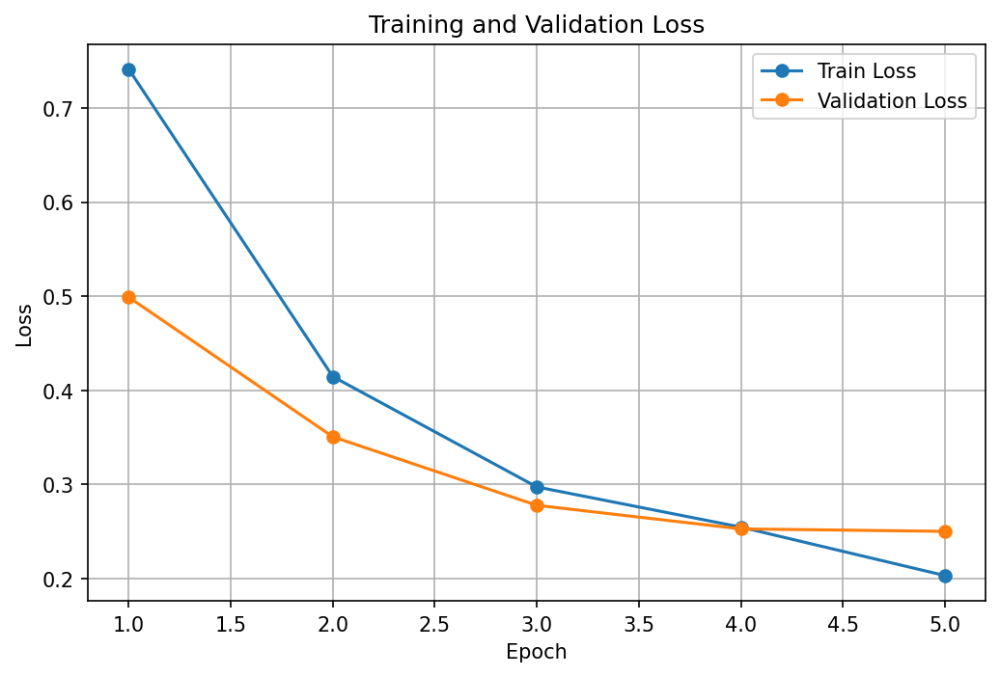
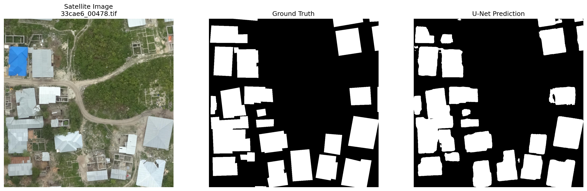

# Satellite Building Segmentation from Geospatial Imagery

End-to-end learning project based on Fractal AI's article **[Understanding Satellite Image for Geo-spatial Deep Learning](https://medium.com/@fractal.ai/understanding-satellite-image-for-geo-spatial-deep-learning-a1a7dee2f2de)**.

The project now covers two stages:

1. **Geospatial preprocessing** — convert a large georeferenced aerial image and vector building footprints into aligned 1024×1024 image/mask tiles.
2. **Semantic segmentation** — train a U-Net to predict building pixels from the prepared satellite-image tiles.

The current model results are a **same-scene held-out validation baseline**. All 754 tiles come from the same original `33cae6` geographic scene, so the reported metrics should not be interpreted as cross-city or cross-location generalization.

## End-to-End Pipeline

```text
RAW GEOTIFF + GEOJSON
        ↓
inspect raster metadata / CRS
        ↓
resample imagery to 0.1 m/pixel
        ↓
reproject building footprints
        ↓
rasterize polygons into binary mask
        ↓
1024×1024 image/mask tiles
        ↓
train/validation split
        ↓
U-Net + ResNet34 encoder
        ↓
validation metrics
        ↓
predicted building masks
```

The original preprocessing pipeline is illustrated below:


## Dataset

This project uses the `znz/33cae6` scene from the **Open Cities AI Challenge** dataset.

Dataset sources:

- Source Cooperative: https://source.coop/open-cities/ai-challenge
- DrivenData competition: https://www.drivendata.org/competitions/60/building-segmentation-disaster-resilience/
- Dataset DOI: https://doi.org/10.34911/rdnt.f94cxb

### Source GeoTIFF

`33cae6.tif`:

- Width: **37,113 pixels**
- Height: **34,306 pixels**
- Bands: **4**
- CRS: **EPSG:32737**
- Resolution: **0.0774800032377243 m/pixel**

### Building annotations

`33cae6.geojson`:

- **4,439** building-footprint features
- GeoJSON vector polygons
- reprojected to the raster CRS before rasterization

## Stage 1 — Geospatial Preprocessing

Implemented in:

```text
notebooks/01_satellite_image_exploration.ipynb
```

The notebook performs:

1. GeoTIFF inspection with Rasterio.
2. Raster metadata, CRS, bounds, transform, resolution, and band inspection.
3. Resampling from approximately **0.07748 m/pixel** to **0.1 m/pixel** with GDAL.
4. RGB visualization.
5. GeoJSON loading with GeoPandas.
6. Reprojection of building polygons into `EPSG:32737`.
7. Rasterization into a binary building mask.
8. Saving the mask as a 1-bit GeoTIFF.
9. Splitting the image into **1024×1024** tiles.
10. Splitting the mask using identical windows.
11. Visual verification of image/mask alignment.

### Preprocessing output

The resampled raster has:

- Width: **28,755 pixels**
- Height: **26,580 pixels**
- Resolution: **0.1 × 0.1 m/pixel**

The generated binary mask uses:

```text
0 = background
1 = building
```


The final preprocessing stage produces:

- **754 image tiles**
- **754 matching mask tiles**
- tile size: **1024×1024**


Large raw and generated raster data are intentionally excluded from Git.

## Stage 2 — U-Net Semantic Segmentation

Implemented in:

```text
notebooks/02_building_segmentation_unet.ipynb
```

### Why semantic segmentation?

The target is one binary mask per tile:

```text
background = 0
building   = 1
```

The task is therefore **binary semantic segmentation**: every image pixel is classified as either building or background.

A U-Net is used instead of Mask R-CNN because the prepared labels do not preserve separate building-instance IDs. U-Net directly predicts the required pixel-level binary mask and is a simpler baseline for this dataset.

### Model

- Architecture: **U-Net**
- Encoder: **ResNet34**
- Encoder initialization: **ImageNet pretrained weights**
- Input channels: **3 (RGB)**
- Output channels: **1**
- Output activation during training: none; the network returns **logits**
- Probability conversion during inference: `sigmoid`
- Binary threshold: **0.5**

The fourth raster band was not used as a model input; inspection showed it behaved as a constant alpha/validity band for the sampled imagery.

### Dataset split

The 754 tiles were split using:

```python
train_test_split(
    df,
    test_size=0.20,
    random_state=42,
    stratify=df["has_building"]
)
```

where `has_building = 1` when a tile contains at least one building pixel.

| Split | Tiles | Tiles containing buildings | Mean building-pixel fraction |
|---|---:|---:|---:|
| Train | 603 | 282 | 8.69% |
| Validation | 151 | 70 | 9.04% |

The split manifest is saved in `results/dataset_manifest.csv` for reproducibility.

### Training setup

- Framework: **PyTorch**
- Segmentation library: **segmentation-models-pytorch**
- Loss: **Binary Cross-Entropy with logits + Dice loss**
- Optimizer: **AdamW**
- Learning rate: **1e-4**
- Batch size: **2**
- Epochs: **5**
- Mixed precision: PyTorch AMP
- Hardware: **Kaggle Notebook, NVIDIA Tesla T4 GPU**
- Best checkpoint selected using **validation Dice score**

BCE provides pixel-wise classification supervision, while Dice loss directly rewards overlap between the predicted and ground-truth building regions. This is useful because building pixels make up only about 9% of the dataset.

## Baseline Results

The best checkpoint was obtained at **epoch 4**.

| Metric | Validation result |
|---|---:|
| IoU / Jaccard | **0.7954** |
| Dice | **0.8860** |
| Precision | **0.8956** |
| Recall | **0.8767** |
| Validation loss | **0.2527** |

These metrics were calculated **only on the 151 validation tiles**.

Predictions were generated using:

```python
probabilities = torch.sigmoid(logits)
predictions = (probabilities >= 0.5).float()
```

The segmentation metrics were computed globally over the validation pixels (micro aggregation), rather than calculating each metric per image and averaging the image-level scores.

### Training curve



### Example prediction

The following example is a validation tile that was not used for parameter updates during training.



The model captures most large building footprints, although some boundary errors, missed regions, and false-positive pixels remain.

## What the Metrics Mean

For binary building segmentation:

- **IoU / Jaccard** measures the intersection of predicted and true building pixels divided by their union.
- **Dice** measures overlap using twice the intersection divided by the total predicted and true building pixels.
- **Precision** asks: of the pixels predicted as building, how many are actually building pixels?
- **Recall** asks: of all true building pixels, how many did the model recover?

The reported values are based on thresholded validation predictions, not training predictions.

## Important Limitation: Geographic Leakage

All 754 tiles were generated from the same large `33cae6` scene. The 80/20 split was performed at the tile level, so geographically nearby tiles may appear in both training and validation sets.

Therefore, the current result demonstrates:

> performance on held-out tiles from the same source scene.

It does **not** yet demonstrate:

> reliable generalization to a completely unseen city, sensor, or geographic scene.

The next planned experiment is to preprocess a second labeled Open Cities scene using the same pipeline and evaluate the saved baseline model **without retraining first**. That experiment will provide a more meaningful test of geographic generalization.

## Project Structure

```text
satellite-geospatial/
│
├── data/                         # excluded from Git
│   ├── raw/
│   ├── processed/
│   ├── images/
│   └── masks/
│
├── docs/
│   └── images/
│       ├── pipeline.svg
│       ├── mask_overview.png
│       ├── tile_pair.png
│       ├── training_loss.png
│       └── segmentation_result.png
│
├── notebooks/
│   ├── 01_satellite_image_exploration.ipynb
│   └── 02_building_segmentation_unet.ipynb
│
├── results/
│   ├── dataset_manifest.csv
│   ├── final_metrics.csv
│   └── training_history.csv
│
├── .gitignore
├── requirements.txt
└── README.md
```

## Installation

Recommended local preprocessing environment:

- Python 3.10+
- Ubuntu / WSL
- VS Code / Jupyter
- GDAL

Create a virtual environment:

```bash
git clone https://github.com/Sanketsingh77/satellite-geospatial.git
cd satellite-geospatial

python3 -m venv .venv
source .venv/bin/activate
python -m pip install --upgrade pip
pip install -r requirements.txt
```

Install the GDAL command-line tools on Ubuntu/WSL:

```bash
sudo apt update
sudo apt install gdal-bin
```

## Reproducing the Preprocessing Stage

Create the data directories:

```bash
mkdir -p data/raw data/processed data/images data/masks
```

Download the `33cae6` imagery and annotation from the public Open Cities AI Challenge dataset and place them at:

```text
data/raw/33cae6.tif
data/raw/33cae6.geojson
```

Then run:

```text
notebooks/01_satellite_image_exploration.ipynb
```

from top to bottom.

## Reproducing the U-Net Baseline

The model notebook is designed around the already generated `data/images` and `data/masks` tiles. The training run reported here was executed on Kaggle using an NVIDIA T4 GPU.

The notebook performs:

```text
load 754 image/mask tiles
        ↓
measure building coverage
        ↓
80/20 stratified train/validation split
        ↓
PyTorch Dataset + DataLoader
        ↓
U-Net with ResNet34 encoder
        ↓
BCE + Dice training loss
        ↓
5 training epochs
        ↓
select best validation Dice checkpoint
        ↓
IoU / Dice / Precision / Recall
        ↓
visual predictions
```

The trained `.pth` checkpoint is intentionally not committed to this repository because model binaries are large. It can be reproduced by running the training notebook.

## Main Libraries

| Tool | Purpose |
|---|---|
| Python | Pipeline and model implementation |
| Rasterio | GeoTIFF I/O, metadata, transforms, windows |
| GeoPandas | Vector annotation loading and CRS reprojection |
| Shapely | Geometry handling |
| GDAL | Raster resampling |
| NumPy | Array operations |
| Matplotlib | Visualization |
| PyTorch | Dataset loading, training, inference |
| segmentation-models-pytorch | U-Net with pretrained ResNet34 encoder |
| scikit-learn | Reproducible stratified train/validation split |
| pandas | Dataset manifest and training history |

## Current Status

Completed:

- geospatial preprocessing
- binary building-mask generation
- 1024×1024 image/mask tiling
- U-Net semantic-segmentation training
- held-out tile validation
- IoU, Dice, precision, and recall evaluation
- prediction visualization

Next:

- evaluate the current frozen U-Net on a **completely unseen labeled geographic scene** before deciding whether additional training scenes or model changes are justified.
